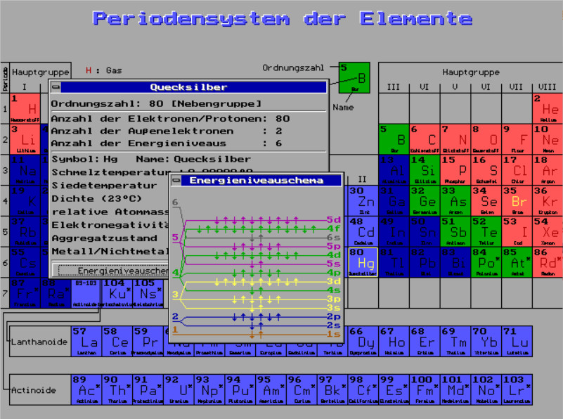

# 1996: My final thesis in compter science at school

1996 was the only school year in which I had computer science lessons. I must have been in the 11th grade. A few friends and I already had a few years of experience with Borland Pascal. While the class was taking its first steps, we were given time off for motivational reasons ;-).

Because I had no other hobbies, this became my final project: the periodic table of the elements, displayed in graphics mode under MS DOS, with two databases I had invented myself. One database was for the chemical elements with their properties, the second for chemical compounds. Both were - of course - only filled with sample data and both are expandable in the program.

Back then, I implemented the graphical dialogs in [CONTROLS.PAS](src/CONTROLS.PAS) in an object-oriented way - I think that was the new cool shit in Pascal at the time. It made it much easier for me to create the many dialogs, but it was also a bit lame. Today you don't notice any of that anymore.

## Run it

Download the whole [bin-Directory](bin/) on your PC. You have several options to run it:

### The original MS DOS way

Use your PC with an IBM 8088 Processor or higher with min. 512k of memory. A compatible pointing device is required. The AMD 80486DX 40 CPU with 4MB RAM, which I have tested extensively, is highly recommended.

Make sure that the mouse driver is loaded correctly:

```autoexec.bat
LoadHigh C:\DOS\MOUSE.COM
```

### Virtual Periodic System of Elements featured by VirtualBox :-)

Run MS DOS 6.x in your VirtualBox. In addition to a [suitable mouse driver](https://git.javispedro.com/cgit/vbados.git/about/), you will also benefit from the use of [DOSIdle](http://www.win16.info/files/patch/dosidle.img) and [WinFloat](http://www.win16.info/files/winfloat.img):

```autoexec.bat
C:\VIRTBOX\DOSIDLE.EXE
C:\VIRTBOX\HIDE87.COM
C:\VIRTBOX\VBMOUSE.EXE install
C:\VIRTBOX\VBMOUSE.EXE wheelkey updn
```

### Using dosbox-x

[DOSBox-X](https://dosbox-x.com/) is a DOS emulator being available for Linux, Windows and macOS. At least in my Ubuntu it works smooth ...

```bash
sudo apt install dosbox-x
dosbox-x -x CHEMIE.EXE
```



## Compile the source code

Yes, you can still compile the source code yourself! It certainly works with [Borland Pascal 7.0](https://winworldpc.com/product/borland-pascal/7x), but Turbo Pascal should also work. In the editor, all individual libraries must be compiled into TPU files. At the very end, the CHEMIE.PAS can be compiled into a CHEMIE.EXE. It is easier and quicker to do this on the command line:

```dos
BPC.EXE -B -CD CHEMIE.PAS
```

